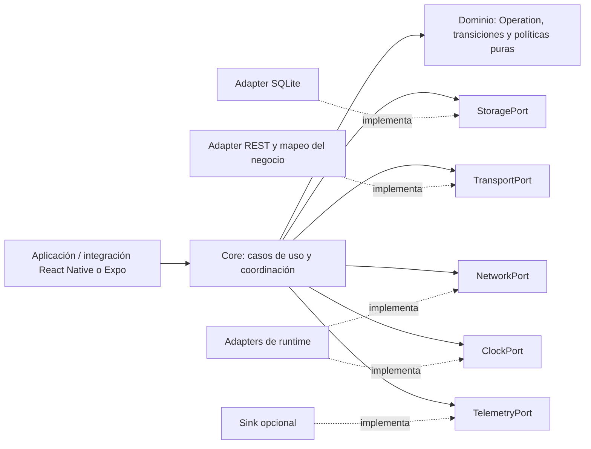
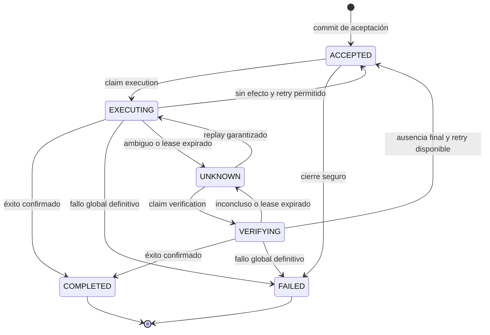

# FlorexTech — Mobile Operation Reliability

**Estado:** especificación de arquitectura, sin implementación. **Fecha:** 2026-09-15.

## 1. Propósito y autoridad

El SDK conserva intenciones de negocio y coordina intentos de ejecución y verificación contra APIs existentes. `order.create`, `payment.create` e `inventory.update` son Operations; una petición REST es una posible materialización de un intento.

Este documento y los [ADRs vigentes](docs/adr/README.md) definen el contrato normativo. **DEBE**, **NO DEBE** y **PUEDE** expresan obligación, prohibición y opción. Los ADR-001 a ADR-008 se conservan como antecedentes sustituidos explícitamente. El roadmap existente es una secuencia orientativa: sus ejemplos de estados, dependencias y fases no amplían este MVP ni permiten posponer invariantes de seguridad hasta después de ejecutar efectos reales.

**Por qué:** una cola HTTP pierde la identidad del negocio cuando una respuesta se pierde. Una Operation permite conservar esa identidad y reconocer honestamente cuándo el resultado remoto es desconocido.

### Garantías y condiciones

- Una aceptación exitosa implica un commit durable previo a cualquier ejecución remota.
- Las transiciones son atómicas, condicionadas por versión y, cuando corresponde, por ownership vigente.
- Un intento remoto ambiguo nunca se convierte en fallo definitivo por timeout, antigüedad o agotamiento de intentos.
- El SDK no vuelve a ejecutar una intención potencialmente aplicada sin una garantía específica de replay seguro.
- Reiniciar recupera estado desde storage; no depende de promesas, timers o callbacks anteriores.
- No hay garantía de exactly-once, entrega eventual incondicional, ejecución mientras el SO suspende la app, orden global ni coordinación entre dispositivos.
- La durabilidad cubre reinicio de runtime/proceso y del dispositivo dentro de las garantías comprobadas del adapter y su medio de almacenamiento. No cubre desinstalación, borrado de datos, pérdida física, corrupción irrecuperable ni restauración de backups antiguos. No equivale a backup remoto.
- El progreso exige runtime activo, storage disponible, credenciales correctas y backend accesible. Una operación puede quedar UNKNOWN indefinidamente.

**Por qué:** seguridad significa no inventar resultados ni introducir duplicados evitables; disponibilidad y resolución dependen también del backend y del sistema operativo.

## 2. Límites hexagonales

Las interfaces pertenecen al Core; los adapters dependen de ellas, nunca al revés. El dominio decide transiciones con datos explícitos; no consulta reloj, storage o red. La capa de aplicación del Core orquesta esos puertos. El composition root de la app conecta dependencias y registra definiciones de operaciones.

El Core no importa React, React Native, Expo, SQLite, Fetch, Axios, NetInfo, timers globales ni APIs de plataforma. Tampoco serializa closures. No se agregan bus, repositorios genéricos, contenedor DI, event sourcing, plugin framework o puerto por cada clase. Un registro de definiciones y funciones puras es suficiente.

**Por qué:** cinco límites de efectos bastan para probar recuperación y sustituir runtimes. Separar dominio de coordinación evita convertir cada decisión interna en una abstracción pública.

El adapter de transporte convierte intención en REST y obtiene credenciales al ejecutar. La integración móvil aporta señales de red y activación del runtime. Los hooks futuros sólo observarán casos de uso del Core.

## 3. Modelo de dominio

### 3.1 Operation: agregado durable

Una Operation tiene una identidad y un destino de negocio inmutables; su registro de ejecución evoluciona mediante transiciones. La siguiente tabla es un contrato conceptual, no una declaración TypeScript implementada.

| Campo | Regla | Por qué |
|---|---|---|
| `id` | Identificador opaco único dentro del store, generado antes de submit por la app o helper del runtime; estable en toda su vida | Permite resolver aceptación ambigua y reanudar por ID sin un IdentityPort adicional |
| `type`, `definitionVersion` | Nombre de negocio y versión exacta del contrato registrado | Una actualización de la app no debe reinterpretar silenciosamente una intención pendiente |
| `payload` | Snapshot inmutable, validado y serializable como JSON acotado; sin funciones, referencias mutables, tokens o archivos temporales | Debe sobrevivir al runtime y reproducir el mismo significado |
| `principalScope`, `targetScope` | Identidades estables de cuenta/tenant y backend lógico; no credenciales | Impide enviar trabajo del usuario A bajo sesión B o hacia otro entorno |
| `idempotencyKey` | Opcional, estable; sólo tiene garantía si el backend la aplica | Un header por sí mismo no evita duplicados |
| `policySnapshot` | Límites finitos de execution/verification, backoff, timeout y referencia versionada a garantías de replay | Reinicios y nuevas configuraciones no reinician presupuestos ni amplían seguridad |
| `status` | Uno de los seis estados definidos abajo | Separa hechos del negocio de detalles del scheduler |
| `revision` | Entero creciente en cada mutación atómica, incluido lease | Impide escrituras perdidas y callbacks obsoletos |
| `acceptedAt`, `updatedAt` | Timestamps de pared informativos | Facilitan inspección; no establecen causalidad |
| `executionCount`, `verificationCount` | Contadores durables incrementados al claim correspondiente | Un crash no restablece el presupuesto |
| `activeAttempt` | ID único, clase execution/verification, ordinal, `startedAt`, `deadlineAt`; presente sólo en estados activos | Vincula resultados a un único intento reservado |
| `lease` | `ownerId`, `fence`, `expiresAt`; presente sólo en estados activos | Coordina procesos y rechaza escrituras de dueños antiguos |
| `nextActionAt`, `nextActionKind` | Acción programada execution/verification o ninguna; no un estado nuevo | Modela espera sin QUEUED, RETRYING ni BLOCKED |
| `unresolvedEffect` | Marca durable de que algún intento de ejecución podría haber aplicado la intención | Un rechazo de un intento posterior no borra ambigüedad anterior |
| `lastEvidence`, `lastError` | Resumen tipado, acotado, correlacionado a intento/Operation; sin body crudo | Conserva fundamento de decisiones sin almacenar respuestas sensibles completas |
| `completion` o `failure` | Evidencia terminal y referencia/resultado mínimo validado, mutuamente excluyentes | Permite explicar por qué terminó |
| `holdReason` | Opcional: credenciales, definición faltante, presupuesto de verificación, configuración | Una pausa operativa no afirma un resultado remoto |
| `recordSchemaVersion` | Versión del formato durable independiente de la versión del negocio | Migrar storage no implica migrar la intención |

Los campos de entrada, incluido `policySnapshot`, constituyen la identidad semántica de una aceptación. Repetir `submit` con el mismo ID y contenido canónico devuelve el registro existente; mismo ID con diferencias da `IdentityConflict`. La igualdad DEBE basarse en contenido canónico completo o una comparación con garantías equivalentes, no sólo en un hash corto. Dos IDs diferentes representan dos operaciones aunque sus payloads coincidan. El store también rechaza reutilizar una clave idempotente dentro de su scope con una Operation distinta, para evitar correlaciones ambiguas; no deduplica por semejanza de payload.

### 3.2 Definición registrada y Attempt

Cada par `type + definitionVersion` registra validación de entrada, mapeo semántico del transporte, clasificación de evidencia, estrategia opcional de verificación y contrato de replay. La definición es código de integración en memoria; sólo su referencia/versionado y datos se persisten. Una definición faltante pausa el trabajo, conserva ownership durable y se hace visible.

Un Attempt es una reserva durable para una interacción externa. Incrementar el contador significa **intento reservado**, no prueba de que se enviaron bytes: después de un crash esa distinción es imposible. No posee una nueva intención ni una nueva clave idempotente. Una invocación execution genera como máximo un intento de mutación; retries internos de clientes HTTP, redirects que reenvíen mutaciones y middlewares de replay deben deshabilitarse o estar cubiertos explícitamente por el contrato. Refresh de credenciales previo al envío puede fallar sin efecto de negocio.

**Por qué:** contabilizar sólo respuestas permitiría retries ilimitados después de crashes; ocultar retries dentro del transporte invalidaría las decisiones del Core.

## 4. OperationStatus y semántica

El conjunto completo del MVP es **ACCEPTED, EXECUTING, UNKNOWN, VERIFYING, COMPLETED, FAILED**. CREATED es una entrada todavía no aceptada, no un estado persistido. No hay CANCELLED, RETRYING, QUEUED ni BLOCKED.

### ACCEPTED

Como **recibo de submit**, significa: el SDK confirmó que posee durablemente la operación. Se emite sólo después de confirmar el commit de registro y transición inicial. Es un hecho histórico que sigue siendo cierto aunque el scheduler ya haya avanzado a otro estado cuando el caller reciba el handle.

Como **estado actual**, significa: operación durable, sin efecto anterior pendiente de resolución y disponible para ejecución cuando se cumplan tiempo, presupuesto y precondiciones. Incluye espera offline, backoff y pausas de configuración. Volver a ACCEPTED después de un intento seguro no crea otra aceptación ni otra operación.

Si el commit devuelve resultado indeterminado, submit devuelve `AcceptanceIndeterminate` con el ID; no devuelve ACCEPTED ni asegura que no se guardó. El caller consulta o repite el mismo ID. Una operación cuyo commit sí ocurrió podría ejecutarse aunque el caller no haya recibido el recibo. Sólo una certeza de rollback autoriza afirmar que no se aceptó.

**Por qué:** el límite durable y la entrega de la respuesta al caller no son atómicos. Repetir con otro ID puede duplicar intenciones.

### COMPLETED

Terminal. Existe evidencia del backend que confirma el resultado de negocio para **esta Operation**, persistida en la misma transacción que el estado. Puede provenir de execution o verification. No basta un HTTP 2xx genérico: un 202 de recepción o un body no interpretable no confirma finalización. Una respuesta 204 sólo sirve si el contrato del endpoint afirma finalización.

COMPLETED confirma el resultado al momento indicado por el backend; no promete que un pedido no sea cancelado o un pago revertido posteriormente. Esos son otros hechos de negocio.

### FAILED

Terminal. Existe evidencia suficiente de que la intención no se completó, no queda un intento ambiguo o remoto pendiente, y no habrá más ejecución para esta Operation. Incluye rechazo definitivo de negocio o agotamiento de presupuesto tras intentos **todos resueltos sin efecto**. `failure.kind` distingue rechazo de negocio, agotamiento y rechazo local definitivo previo a cualquier posible efecto.

Un fallo en storage, credenciales, programación o configuración por sí solo no demuestra fracaso del negocio; produce error/pausa. Un error de un retry tampoco resuelve intentos previos inciertos. Un usuario que desea corregir un payload fallido presenta una nueva intención con nuevo ID.

### UNKNOWN

Durable, no terminal, potencialmente indefinido. Algún intento puede haber aplicado el negocio o el backend informó que sigue pendiente. Incluye timeout, conexión cortada después de posible envío, respuesta incompatible y recuperación de EXECUTING abandonado. Presupuesto agotado o ausencia de verifier deja UNKNOWN sin acción programada.

**Por qué:** FAILED autoriza decisiones de negocio distintas de UNKNOWN. Inventar fracaso ante silencio puede generar dos pagos o una compensación indebida.

### EXECUTING y VERIFYING

Estados activos con lease e intento durable. EXECUTING indica autorización local para intentar mutación, no recepción remota. VERIFYING indica consulta para obtener evidencia de una incertidumbre previa. Durante un replay desde UNKNOWN, EXECUTING conserva `unresolvedEffect=true` hasta obtener evidencia global suficiente.

## 5. Máquina de estados completa

### Tabla normativa de transiciones

Cada transición valida versión, scope, precondiciones y evidencia; actualiza agregado y evento atómicamente. La tabla es exhaustiva: cualquier cambio de estado no listado es inválido.

| Origen → destino | Trigger y guardas | Efecto durable / razón |
|---|---|---|
| Ausente → ACCEPTED | Entrada válida y unicidad comprobada; commit confirmado | Inicializa contadores, `unresolvedEffect=false`, evento inicial |
| ACCEPTED → EXECUTING | Due, definición/credenciales/scope aptos, executionCount < límite; claim atómico | Crea intento y lease, incrementa contador; antes de invocar transporte |
| ACCEPTED → FAILED | Rechazo local definitivo o presupuesto agotado, sin incertidumbre | Persiste motivo; nunca por mera espera offline |
| EXECUTING → COMPLETED | Evidencia de éxito correlacionada a la intención | Cierra intento/lease, guarda confirmación y limpia incertidumbre |
| EXECUTING → ACCEPTED | Evidencia de no efecto; no existe ambigüedad previa; retry admitido y presupuesto restante | Cierra lease, programa backoff; no genera nueva intención |
| EXECUTING → FAILED | Rechazo global definitivo o no efecto sin incertidumbre y sin más retries | Guarda fallo; un rechazo de este intento aislado es insuficiente si existía incertidumbre |
| EXECUTING → UNKNOWN | Resultado ambiguo, backend pendiente, o resultado sin efecto que no resuelve ambigüedad previa | Conserva evidencia, cierra lease; programa acción segura si existe |
| EXECUTING → UNKNOWN | Recuperación: lease expirado | Invalida owner e intento activos; asume posible envío aunque el crash ocurriera antes |
| UNKNOWN → VERIFYING | Verifier disponible, due y presupuesto de verification restante | Reserva consulta, incrementa verificationCount y crea lease |
| UNKNOWN → EXECUTING | Contrato de replay vigente que cubre todos los intentos anteriores; due y presupuesto execution restante | Conserva `unresolvedEffect=true`; reserva intento y nueva fence |
| VERIFYING → COMPLETED | Evidencia autoritativa de éxito de la intención | Cierra lease y guarda confirmación |
| VERIFYING → FAILED | Rechazo global definitivo, o ausencia final sin retry/budget disponible | Limpia incertidumbre y guarda fundamento terminal |
| VERIFYING → ACCEPTED | Ausencia final que descarta también ejecución tardía; retry permitido y presupuesto restante | Limpia incertidumbre, cierra lease, programa execution |
| VERIFYING → UNKNOWN | Pendiente, inconcluso, error de consulta, o lease expirado | Nunca infiere ausencia por fallo del verifier; aplica backoff o pausa |

Todas las transiciones de un estado activo requieren `attemptId`, fence, owner y lease vigente, excepto las de recuperación, que requieren expiración comprobada y CAS sobre el estado actual. Un resultado tardío de un owner invalidado no cambia la Operation; una verificación futura puede recuperar la evidencia.

Mutaciones **sin cambio de estado** permitidas: renovación de lease de un estado activo; programación/hold de ACCEPTED o UNKNOWN; recepción inconclusa de metadatos administrativos acotados. Usan CAS y aumentan revision; no cambian identidad, evidencia terminal ni limpian incertidumbre. No se escriben eventos de transición ficticios por cada heartbeat. Ninguna mutación pública reabre COMPLETED o FAILED.

### Invariantes comprobables

1. `remoteInvocation(op)` implica aceptación durable y claim durable previo.
2. Hay como máximo un lease local vigente por Operation dentro de un store compartido.
3. Un resultado modifica estado sólo si coincide con el intento y fence vigentes.
4. Estados activos si y sólo si tienen intento y lease; estados no activos no los tienen.
5. ACCEPTED y FAILED exigen `unresolvedEffect=false`; UNKNOWN y VERIFYING exigen `true`. EXECUTING admite ambos según su origen; COMPLETED limpia la incertidumbre con evidencia global.
6. La incertidumbre es acumulativa: sólo evidencia sobre todos los intentos relevantes puede eliminarla.
7. COMPLETED y FAILED son terminales y mutuamente excluyentes.
8. Cada transición confirmada tiene exactamente un evento durable identificado por `(operationId, revision)`; telemetry puede perderlo o duplicarlo.
9. Intentos y claves no cambian la identidad, payload, scope o versión de la operación.
10. Presupuestos nunca disminuyen por restart; execution y verification se cuentan por separado.
11. Una señal de conectividad o un timestamp nunca es evidencia de resultado de negocio.
12. No se elimina automáticamente trabajo no terminal, incluido UNKNOWN sin acciones pendientes.

## 6. Retry, replay e idempotencia

**Retry** es un nuevo Attempt de execution para la misma intención, payload, ID y clave. No es reenviar indiscriminadamente una petición ni crear una Operation. Elegibilidad requiere conjuntamente seguridad semántica, presupuesto, vencimiento del backoff y precondiciones de runtime.

- Desde ACCEPTED: sólo cuando los intentos anteriores están resueltos sin efecto.
- Desde UNKNOWN: sólo mediante contrato de replay válido. El MVP no admite override de «aceptar riesgo de duplicado».
- Límites finitos, timeout y backoff exponencial acotado se congelan al aceptar. El valor numérico es configuración explícita, no una garantía universal de arquitectura. Se rechazan valores inválidos, infinitos o inconsistentes.
- Jitter recibe una muestra explícita de una función inyectada en la composición (no un puerto nuevo); el instante elegido se persiste una vez. La política pura recibe contadores, evidencia y tiempo. Tests controlan la muestra.
- `Retry-After` sólo modifica cuándo; nunca prueba que un retry sea seguro. Una pausa offline no consume intentos hasta que hay claim.
- Agotar executionCount con incertidumbre conserva UNKNOWN y todavía permite verification dentro de su presupuesto. Agotar verification deja UNKNOWN detenido y visible. Un trigger manual no salta guardas ni reinicia contadores.

Un contrato de replay debe declarar scope de clave, atomicidad entre deduplicación y efecto, tratamiento de solicitudes simultáneas/en progreso, igualdad del payload, retención y recuperación de resultado. «Endpoint idempotente» exige que repetir bajo concurrencia tenga el mismo efecto de negocio completo, incluidos efectos secundarios; no se deduce del verbo HTTP.

Si la protección vence, el SDK deja de usarla para replay. Una ventana basada en hora exige margen conservador y reloj fiable dentro del contrato; ante saltos o incertidumbre de tiempo, se deshabilita ese replay hasta verificar. Como base conservadora se toma la primera reserva durable de execution, nunca se reinicia la ventana con cada retry. La integración debe justificar que esa base y el margen caen dentro de la retención real del backend.

**Por qué:** una clave retenida 24 horas no protege un replay del día 3; un lease local tampoco obliga al servidor a deduplicar. No se promete ni siquiera at-least-once remoto incondicional: una operación insegura se detiene antes de arriesgar un segundo efecto.

## 7. Verification

Verification obtiene evidencia del resultado de **la misma intención** sin volver a ejecutar su mutación. Se configura opcionalmente en TransportPort, usando identidad de negocio o clave idempotente. No hay un VerificationPort adicional: comparte boundary remoto, pero tiene resultado y presupuesto distintos.

| Resultado | Significado / decisión |
|---|---|
| `CONFIRMED_COMPLETED` | Resultado autoritativo y correlacionado → COMPLETED |
| `CONFIRMED_REJECTED` | Rechazo definitivo global, sin efecto ni trabajo pendiente → FAILED |
| `FINAL_NOT_APPLIED` | Prueba de que ningún intento aplicó ni puede aplicar después → ACCEPTED si hay retry; FAILED si no |
| `PENDING` | El servidor conoce trabajo aún sin finalizar → UNKNOWN y nueva consulta acotada |
| `INCONCLUSIVE` | No hay prueba suficiente → UNKNOWN |

Un 404, una búsqueda en réplica eventual o «todavía no existe» son INCONCLUSIVE salvo que el protocolo garantice ausencia final y cierre de solicitudes previas. Incluso una lectura linealizable que hoy no encuentra el pago no descarta que un request anterior llegue mañana. Se necesita un cierre/fencing remoto, rechazo definitivo correlacionado o contrato equivalente. Sin ello, sólo un replay idempotente vigente permite ejecutar de nuevo.

**Por qué:** verificar existencia es fácil; probar que una mutación anterior nunca ocurrirá es una obligación mucho más fuerte. El SDK no puede añadir esa capacidad a una API que no la ofrece.

## 8. Modelo de concurrencia

- Unidad de exclusión: una Operation en un StoragePort compartido. Distintas operaciones pueden ejecutarse en paralelo. Concurrencia por worker acotada, default 1; no implica serialización global entre procesos ni orden de negocio.
- Cada activación genera `ownerId` único. Un claim transaccional selecciona un candidato eligible, revalida estado/revision/presupuesto y escribe estado activo, intento, contador, lease y evento. Sólo su ganador llama al transporte.
- `fence` es un entero monotónico por Operation que nunca se reutiliza; se incrementa al nuevo claim/invalidez. Cada mutación de resultado y renovación comprueba fence, owner, attemptId, revision y no expiración.
- La renovación ocurre antes de vencer; un lease vencido no se revive. Recuperación invalida el owner mediante CAS y lleva el estado activo a UNKNOWN, nunca directamente a una cola ejecutable.
- Storage define un punto de linearización por mutación. Lecturas de candidatos no otorgan permiso. Los límites del worker y señales repetidas no sustituyen la transacción.
- Timeouts y abort son best effort. Aunque un worker pierda el lease, su request puede seguir en vuelo. Antes del envío comprueba ownership, pero esa comprobación no elimina la carrera posterior. La única protección remota es el contrato de backend.
- El reloj de pared es comparable entre runtimes del mismo dispositivo, pero puede saltar. Un salto adelante puede adelantar recuperación; uno atrás puede retrasarla. Fencing protege escrituras locales; UNKNOWN y replay seguro protegen la decisión remota. Nunca se usa expiración como prueba de no efecto.

**Por qué:** un mutex JavaScript no coordina dos runtimes ni sobrevive a process death. Los leases permiten recuperación; fencing evita que un callback viejo sobrescriba un resultado nuevo. No garantizan ausencia de requests simultáneos en el servidor.

No se incluyen dependencias, orden por entidad ni locks distribuidos entre dispositivos. La app no debe asumir que dos `inventory.update` mantienen orden de submit. Si ese orden es necesario, este MVP no satisface ese caso sin soporte del backend.

## 9. Modelo de crash recovery

Al activar el engine: abrir y validar storage/migraciones, registrar definiciones, leer trabajo en páginas, recuperar leases vencidos por CAS y programar trabajo elegible. Los leases todavía vigentes se respetan. Eventos de foreground/reconexión son hints para repetir el barrido; las suscripciones no son la única fuente de progreso.

| Punto del crash / fallo | Estado durable posible | Recuperación |
|---|---|---|
| Antes del commit de aceptación | Ausente | No hay trabajo; mismo ID se puede presentar |
| Durante commit de aceptación | Ausente o ACCEPTED | Leer/repetir mismo ID; nunca generar otro ID automáticamente |
| Tras commit, antes del recibo al caller | ACCEPTED o más avanzado | Submit idempotente devuelve registro existente |
| Después de claim, antes de enviar | EXECUTING | Al vencer lease → UNKNOWN; no puede probarse que no hubo envío |
| Servidor aplicó, respuesta perdida | EXECUTING o UNKNOWN | Verificar o replay garantizado |
| Respuesta recibida, commit de resultado falla | EXECUTING, UNKNOWN o terminal si commit ocurrió | Leer estado; reintentar commit con misma evidencia sólo bajo lease vigente; nunca reenviar por este fallo |
| Commit terminal exitoso, evento UI perdido | COMPLETED/FAILED | Consulta durable reconstruye la vista |
| Verifier muere | VERIFYING | Lease vencido → UNKNOWN; reprogramar consulta dentro de presupuesto |
| Worker antiguo responde tras takeover | Nueva revision/fence | Rechazar resultado obsoleto; no sobrescribir |
| Storage no disponible/corrupto | No se puede establecer estado confiable | Detener nuevos envíos y reportar error de infraestructura; no borrar ni recrear store automáticamente |

Si el storage cae con requests en vuelo, esos requests pueden completar remotamente. El engine no reporta transición terminal sin commit. El resultado conocido sólo en memoria se puede perder; recovery permanece conservador.

**Por qué:** no existe transacción atómica entre el commit local y el backend REST. Cada hueco se cubre con persistencia previa o incertidumbre explícita, nunca adivinando lo ocurrido.

## 10. Contratos de puertos

Son contratos semánticos implementables en TypeScript estricto; nombres y tipos públicos finales se diseñarán al implementar. Los resultados discriminados separan conflicto esperado, fallo cierto e indeterminación. Ningún adapter decide por su cuenta el lifecycle.

### 10.1 StoragePort

| Operación conceptual | Entrada → salida | Obligación |
|---|---|---|
| `open` | Versión esperada → ready/error | Validar durabilidad, esquema y migraciones antes de aceptar/enviar |
| `accept` | Snapshot inmutable + evento inicial → inserted/existing/conflict/indeterminate/error | Unicidad, agregado y evento en una transacción durable; existing devuelve snapshot actual |
| `get` | Scope + ID → snapshot/absent/error | Lectura consistente de registro completo; no mezclar revisiones |
| `scanWork` | Scope + cursor + límite → candidatos + cursor | Paginación acotada y selección estable; no concede ownership |
| `claim` | ID, revision esperada, acción, owner, hora, duración → claimed/conflict/error | CAS atómico de todas las guardas, intento, fence, lease, contador y evento |
| `renew` | ID, revision, owner, fence, intento, hora → nueva revision/conflict/error | Sólo lease vigente; extensión acotada y atómica |
| `commitTransition` | ID + precondiciones + transición validada + evidencia + evento → snapshot/conflict/indeterminate/error | Commit atómico; limpia lease al salir de activo; idempotente por ID de mutación |
| `recoverExpired` | ID/revision + hora → UNKNOWN/conflict/error | Comprobar estado activo y expiración, invalidar fence, registrar recuperación atómicamente |
| `updateScheduling` | ID/revision + acción/hold/fecha → snapshot/conflict/error | Sólo scheduling permitido; no modifica hechos de negocio |
| `readEvents` | ID + cursor + límite → eventos + cursor | Historial durable mínimo para diagnóstico; no es fuente para reconstruir agregado |
| `close` | Sin nuevas operaciones → cerrado/error | Libera recursos; nunca borra trabajo |

Toda mutación puede sufrir commit indeterminado: su respuesta debe permitir resolver mediante lectura y `mutationId` estable, sin duplicar contador/evento. Un conflicto CAS es control de concurrencia, no FAILED. La recuperación de un claim ambiguo verifica que owner, attemptId y fence coincidan antes de ejecutar; si no puede confirmarlo, no ejecuta.

La validación de dominio calcula el cambio; el adapter aplica precondiciones contra el estado real en la misma transacción. Se prohíben `save` ciego, `appendEvent` independiente para transiciones y `release` que deje EXECUTING sin lease. Liberar un intento significa confirmar una transición válida. No se mantienen transacciones abiertas durante llamadas de red.

El adapter garantiza aislamiento suficiente para linearizar aceptación, claims y CAS sobre una Operation, incluso con conexiones/procesos simultáneos. Un «commit» en memoria o en buffer no durable no cumple. El adapter SQLite inicial debe documentar configuración efectiva y límites de filesystem, y demostrar resistencia a process kill/reopen y atomicidad real. No se elige aquí librería ni parámetros de SQLite sin validación del runtime.

Migraciones fallidas preservan datos y detienen ejecución. Registros ilegibles se aíslan del scheduler y generan error de storage; no se marcan FAILED ni descartan. Un store de memoria sólo sirve en tests y debe identificarse como no durable.

### 10.2 TransportPort

`execute(context)` recibe snapshot inmutable, attemptId, scope, clave estable y presupuesto temporal; devuelve evidencia semántica. `verify(context)` es una capacidad opcional con los resultados de la sección 7. El transporte no escribe storage, agenda retries ni cambia estados.

| Resultado execution | Obligación de evidencia |
|---|---|
| `CONFIRMED_COMPLETED` | Prueba backend correlacionada al negocio con resultado mínimo validado |
| `CONFIRMED_REJECTED` | Declarar si rechazo cubre la intención completa o sólo este intento; sólo alcance global resuelve incertidumbre previa |
| `NOT_APPLIED` | Prueba de ausencia de efecto de este intento; clasificación retryable/permanent separada |
| `AMBIGUOUS` | Posible aplicación, respuesta no interpretable o servidor pending; no prueba de fallo |

Context y resultados no exponen AxiosError, Response, NetInfo ni excepciones de plataforma al dominio. Evidencia incluye origen, alcance, correlación, timestamp informativo y código sanitizado. Si una excepción escapa del adapter después de autorizar execution y no existe prueba de no envío, el Core usa AMBIGUOUS. Cancelar una promesa, timeout o abort no prueba cancelación remota.

HTTP 4xx/5xx/429 no define por sí solo certeza: un proxy puede fallar después del commit. La definición de negocio y el contrato backend justifican clasificación. Un rechazo de validación conocido antes de cualquier envío sí prueba ausencia de efecto de ese intento. Los endpoints asíncronos que sólo aceptan trabajo permanecen UNKNOWN y requieren consulta.

**Por qué:** mezclar retryability con certeza convierte errores técnicos recuperables en duplicados de negocio.

### 10.3 NetworkPort

`getSnapshot()` devuelve `online | offline | unknown`; `subscribe(listener)` devuelve una función de desuscripción. Sus callbacks son hints, pueden repetirse, retrasarse o perderse. Offline evita nuevos claims automáticos de red; online no garantiza alcance del backend. Unknown permite intentar bajo las guardas normales. El Core vuelve a consultar al activarse y durante barridos programados; puede existir un adapter que siempre devuelva unknown para runtimes sin señales.

**Por qué:** NetInfo no es fuente de verdad sobre el éxito remoto y un evento perdido no debe perder trabajo durable.

### 10.4 ClockPort

Provee `wallNow()` para timestamps y fechas persistidas, `monotonicNow()` para duración dentro de un runtime y `scheduleWake(delay, callback)` con cancelación para despertar al coordinator. El reloj monotónico no se persiste ni compara entre runtimes. Los wakes pueden llegar tarde o no ejecutarse durante suspensión; el scheduler relee tiempo y storage al despertar. Todos los usos temporales son inyectables; tests avanzan un reloj falso sin sleeps reales.

Los valores de pared no ordenan eventos (revision sí). Deben detectarse discrepancias de pared/monotónico durante una sesión; no puede garantizarse detectar todos los saltos ocurridos con la app cerrada. Una garantía de replay dependiente del tiempo requiere resolver esa limitación de forma conservadora.

**Por qué:** separar duración local de fecha durable hace testeables saltos de reloj y reinicios, sin fingir que existe un reloj global perfecto.

### 10.5 TelemetryPort

`emit(event)` ofrece entrega best effort, no bloqueante y con recursos acotados. Un adapter no-op es válido y default. Excepciones se contienen; sinks lentos descartan eventos. Telemetry nunca participa en commit ni decide retry/estado. Se emite después de observar la transición durable y puede duplicarse o perderse tras un crash.

Evento permitido: ID opaco, tipo de evento, revision, estado, ordinal, duración y código sanitizado. Payloads, respuestas completas, tokens, headers y PII no se incluyen por defecto. Incluso IDs y type requieren política de exportación; no hay salida cloud por defecto.

**Por qué:** observabilidad debe ayudar a entender un fallo, no crear otro punto de fallo. El journal durable mínimo pertenece a StoragePort y no depende del sink.

## 11. Taxonomía de errores

Cada error separa **capa**, **certeza del efecto**, **alcance de evidencia** y **acción recomendada**. `retryable=true` no es autorización suficiente de ejecución.

| Categoría | Ejemplos | Consecuencia |
|---|---|---|
| Admisión | Payload inválido, límite de tamaño, tipo desconocido al submit, IdentityConflict | Rechaza entrada; no se crea otra Operation ni se invoca red |
| Persistencia cierta | Rollback confirmado, disk full antes de commit | No se confirma aceptación/transición; error al caller/engine |
| Persistencia indeterminada | Error durante commit, respuesta del store perdida | Resolver por ID/mutationId; no inferir ausencia |
| Concurrencia | RevisionConflict, LeaseLost, StaleAttempt | Descartar escritura/releer; no fallo de negocio |
| Preparación sin envío | Credenciales no disponibles, sesión incompatible, definición ausente tras upgrade | Hold visible; conserva Operation y no consume intentos si se detecta antes de claim |
| Transporte sin efecto probado | Fallo previo a envío comprobable | Retry seguro si no hay ambigüedad anterior y queda presupuesto |
| Transporte ambiguo | Timeout, reset, 5xx sin contrato de no efecto | UNKNOWN |
| Negocio definitivo | Rechazo correlacionado sin efecto y sin pendiente | FAILED cuando cubre toda la intención |
| Verificación | Pendiente, no encontrado no definitivo, fallo de consulta | UNKNOWN; usa presupuesto de verification |
| Contrato/programación | Decoder roto, versión incompatible, transición inválida | Error visible y pausa del trabajo afectado; si pudo enviarse, UNKNOWN |
| Infraestructura storage | Corrupción, esquema incompatible | Detener procesamiento afectado; conservar datos recuperables |
| Observabilidad | Sink caído o saturado | Contener/descartar; no tocar negocio |

Errores públicos incluyen código estable, operationId cuando existe, causa sanitizada y siguiente acción. Stack/cause crudos no se persisten ni exportan por defecto. Un error del SDK no se presenta como rechazo remoto del negocio.

## 12. Lifecycle y developer experience

1. La app configura puertos y definiciones versionadas. Inicialización valida storage antes de habilitar submit/processing.
2. La app crea/conserva un ID y presenta tipo, payload y scope. El Core valida y copia datos.
3. Storage acepta atómicamente. Submit devuelve un recibo/handle basado en ese commit, sin esperar conectividad ni backend. Un storage lento sí puede retrasarlo; «offline-first» no significa aceptación antes de persistir.
4. El scheduler busca elegibilidad, confirma claim durable y ejecuta. Reconnect/foreground/manual wake sólo despiertan al scheduler; no realizan un envío alternativo.
5. El resultado semántico determina una transición con evidencia. Una nueva lectura es la autoridad después de cualquier conflicto o commit ambiguo.
6. El caller consulta por ID o observa snapshots con revision. Una suscripción entrega snapshot inicial y vuelve a leer tras señales; usa revision para ignorar eventos viejos. Las notificaciones no tienen garantía de entrega exactamente una vez.
7. Esperar resultado remoto es una API distinta de submit. El wait devuelve COMPLETED o FAILED; un deadline local devuelve «espera terminada» con snapshot actual, nunca cambia la Operation a FAILED. UNKNOWN se expone durante la espera y puede durar indefinidamente. Un nuevo runtime reconstruye el handle por ID; la promesa anterior no sobrevive.
8. Stop deja de reservar trabajo, cancela wakes y solicita abort best effort. Puede drenar intentos hasta un límite; si no obtiene resultado durable, deja los leases para recovery o confirma UNKNOWN si aún es owner. Stop/logout no borra operaciones ni garantiza cancelación del backend.

Al cambiar de cuenta, el worker no envía operaciones con credenciales de otro principal. Las pendientes quedan retenidas en su scope. Un resultado en vuelo de la cuenta anterior puede persistirse bajo su scope; no se expone a la cuenta nueva. Corregir credenciales reanuda guardas, no reinventa el payload.

**Por qué:** el camino normal debe ser simple —submit, consultar, observar— sin ocultar el intervalo entre posesión local y finalización remota. Los nombres públicos exactos se pueden ajustar después sin alterar esos hechos.

### Ejemplo de pago con respuesta perdida

`payment.create` se acepta offline. Al volver red: claim durable → EXECUTING → backend aplica → respuesta perdida → UNKNOWN. Si la app muere antes de guardar UNKNOWN, recovery obtiene el mismo estado al expirar el lease. Un verifier consulta la misma clave, recibe confirmación autoritativa y confirma COMPLETED localmente. Si no hay verifier ni replay seguro, el pago permanece UNKNOWN: no hay segundo envío automático.

## 13. Estrategia de validación futura

No se implementan tests en esta entrega documental. Antes de publicar garantías se exigirán:

- Tests de tabla y propiedades sobre todos los pares de estados, guardas, incertidumbre acumulada y terminales.
- Suite de conformidad de StoragePort aplicada al adapter real: rollback, commits ambiguos, unicidad, atomicidad agregado/evento, claims concurrentes, fencing y reopen tras matar proceso.
- Transporte falso con efecto remoto separado de entrega de respuesta: «aplicó y perdimos respuesta», «404 antes de que llegue el request anterior», replay que devuelve error tras un éxito previo.
- Recovery en cada frontera de la sección 9, incluido claim confirmado cuyo envío nunca comenzó y resultado terminal confirmado cuyo callback se perdió.
- Reloj falso: saltos adelante/atrás, wakes tardíos, expiración de clave, suspensión mayor que lease, timer perdido.
- Dos workers/ conexiones y respuestas tardías; probar que no sobrescriben nueva fence y que takeover no autoriza replay inseguro.
- Tests de definición ausente, cambio de usuario/backend, payload incompatible, disco lleno y telemetry que lanza excepciones.
- Pruebas de integración de cada mapeo REST para justificar certeza; un mock de HTTP exitoso no demuestra idempotencia del backend.

**Por qué:** el comportamiento de fallos entre dos commits importa más que cobertura de líneas. Un fake store puede probar políticas, pero no durabilidad real.

## 14. Fuera del MVP

| Decisión diferida | Por qué no es necesaria ahora |
|---|---|
| Sync de tablas, CRDTs, merge/conflict resolution, réplica local del backend | Resuelven otro problema: sincronización de datos |
| DAGs, dependencias, orden por entidad, prioridades y fairness avanzada | Amplían considerablemente estados/semántica; requieren casos reales |
| Cancelación de negocio, compensaciones, sagas, rollback remoto | Una cancelación local no revierte efectos remotos |
| Override de replay inseguro y resolución manual forzada | Rompen la interpretación confiable de UNKNOWN y FAILED |
| Background execution garantizada | Depende del SO y no puede prometerse desde el Core |
| Coordination multi-device y failover entre stores | Requiere autoridad remota y otro modelo de ownership |
| Archivos grandes, streaming y uploads resumibles | Necesitan durabilidad de blobs y protocolos específicos |
| Migración automática del payload de negocio | Cambiar una intención ya aceptada exige un contrato de producto específico |
| Cloud, proxy FlorexTech, DevTools completos y event sourcing | No son necesarios para ejecutar y recuperar intenciones |
| GC automático, export/import y restauración de backups | Borrar o reintroducir IDs afecta deduplicación; exige contrato de retención separado |
| Framework propio de cifrado, gestión de claves y OAuth | Se delega al runtime/app; sí son obligatorios aislamiento y minimización |
| Adaptadores para otros protocolos/runtimes | Los puertos dejan el camino abierto; no se implementan sin demanda |

El MVP sí necesita persistencia durable, fencing, UNKNOWN y guardas de replay desde su primer transporte real. La posibilidad de una demo no justifica posponer correctness.

## 15. Riesgos y límites de decisión

| Riesgo | Mitigación y límite residual |
|---|---|
| APIs existentes sin idempotencia/verificación | Primer intento soportado; ambigüedad queda UNKNOWN. No existe solución puramente cliente para garantizar su resolución |
| Clasificador REST demasiado optimista | Default ambiguo; contrato por operación y pruebas contra backend. El adapter es parte de la base de confianza |
| Replay después de expiración de clave | Política versionada, ventana conservadora y pausa ante duda temporal |
| Workers suspendidos con request en vuelo | Lease/fencing local más incertidumbre persistente; backend debe proteger duplicación remota |
| Persistencia supuestamente durable | Conformidad del adapter real y límites documentados del dispositivo/FS |
| Crecimiento indefinido, especialmente UNKNOWN | Límites de admisión y payload; error explícito al agotar capacidad. No borrar trabajo aceptado. Retención antes de producción prolongada |
| Cambio de app, cuenta o entorno | Versiones y scopes inmutables; hold si no hay definición/credenciales compatibles |
| Evidencia y payload sensibles | Minimización, redacción y control de acceso del runtime; cifrado de almacenamiento elegido por la app |
| Falso sentido de garantía comercial | Documentar ACCEPTED como posesión local, no finalización ni backup |
| Liveness limitada por reloj/SO/presupuestos | Reanudar y consultar estado; ningún timeout de observación altera el negocio |

**Criterio de diseño:** si para progresar hay que asumir que un efecto incierto no ocurrió, se conserva UNKNOWN. Esta preferencia explícita por correctness es especialmente importante para pagos e inventario.
